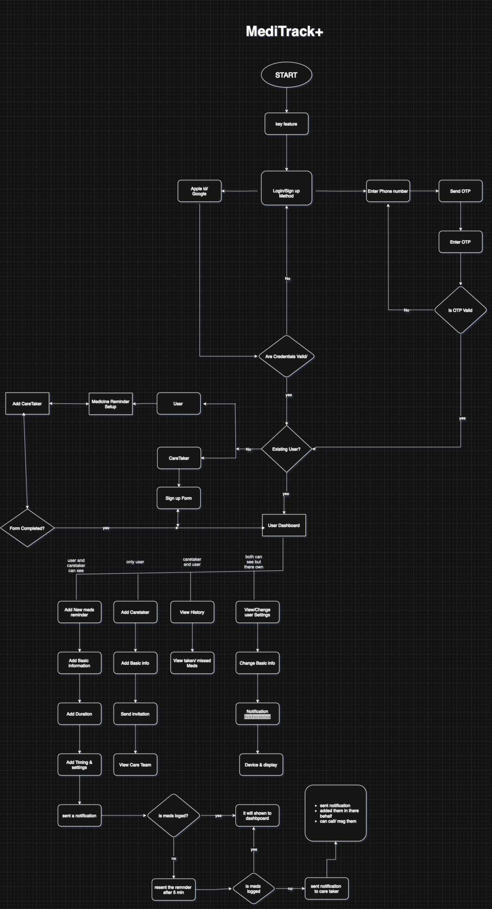

# 🧠 MediTrack+

> A health companion for the forgetful, the elderly, and the caretakers who love them.

---

<p align="left">
  
</p>


---

## 📌 What is MediTrack+?

**MediTrack+** is a mobile app that reminds users to take their medicines — and if they forget, it notifies their caretakers.

Built for:
- 👴 Elderly parents who always say “I’ll take it later”... and don’t.
- 😅 People like me (and maybe you?) who forget even reminders.
- 👩‍⚕️ Caretakers who want peace of mind — without having to call 5 times a day.

---

## 🧠 Why MediTrack+?

Because **"Set a reminder"** isn’t always enough.

We built MediTrack+ to be:
- **Simple** enough for grandparents to use  
- **Smart** enough to know when reminders are ignored  
- **Supportive** enough to include caretakers in the loop

---

## 🔥 Core Features

✅ Clean, easy-to-use mobile interface  
✅ Smart med reminder system  
✅ Alerts caretakers if a dose is missed  
✅ Lightweight, fast backend  
✅ Built for scale with CI/CD + Docker  
✅ Works across Android & iOS

---

## 🛠 Tech Stack

| Part         | Tech Used               |
|--------------|-------------------------|
| 📱 Frontend  | Expo (React Native)     |
| 🧠 Backend   | Go (Golang)             |
| ⚙️ CI/CD     | GitHub Actions          |
| 🐳 Deploy    | Docker                  |
| 🧼 Arch      | REST API + Clean Architecture |

---

## 🧭 System Flow

📊 Full system flow diagram right here.

<p align="left">
  
</p>

---

## 🚀 Getting Started

```bash
# Clone the repo
git clone https://github.com/yourusername/meditrack-plus.git

# Navigate to the frontend/backend folders and follow setup instructions
